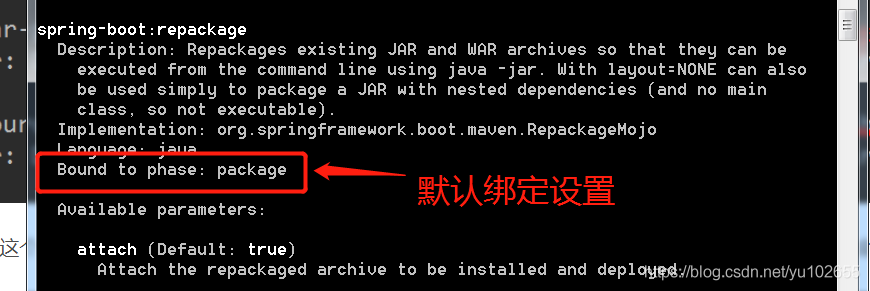

# Maven

- clear（清理项目）:清理
- default（构建项目）:校验、编译、打包、测试
- site（建立项目站点）:部署

## 什么是Maven的生命周期

清理、初始化、编译、测试、打包、集成测试、验证、部署、站点生成

Maven的生命周期是抽象的，就好比Java中的抽象方法，只声明生命周期和阶段，但本身不做任何实际的工作，实际工作都交由插件来完成；相当于Maven定义算法的整体结构，各个插件来实现实际的行为，保证了可扩展性的同时，又严格控制了生命周期结构，优点不言而喻。下面通过下面这个图，简单来说比如我们运行clean，Maven实际调用的是maven-clean-plugin插件的clean（目标）完成的项目结构清理功能，所有生命周期阶段都会有相应的插件完成具体功能。

每个Maven构建步骤都可以绑定一个或多个插件行为（goal），同时Maven也为大多数构建步骤编写并绑定了默认插件。需要注意的是默认插件只提供默认行为实现，当有特殊需要时，比如我们在打包Springboot项目成jar包时，那样就需要引入和配置spring-boot-maven-plugin来完成打包需求。

## 三套生命周期

Maven有三套独立的生命周期，分别为clean（清理项目）、default（构建项目）、site（建立项目站点）。每个项目周期又分为不同的阶段，比如clean生命周期下的阶段依次为：pre-clean->clean->post-clean，用户通过命令行也好，IDE提供的帮助也罢，执行Maven任务的最主要方式就是调用这些生命周期的阶段。这些生命周期的阶段是有顺序的，并且后面阶段的执行依赖于前面阶段。还是拿clean生命周期举例子：当我们调用post-clean阶段时，由于这个阶段前面存在pre-clean和clean两个阶段，最终pre-clean、clean和post-clean会得以顺序执行。其实这个现象开发过程中常见，比如我们在通过package打包springboot项目时，编译、测试、打包都得以执行。由于每个生命周期，特别是default，包含了多个阶段，在此就不一一列举了，只需要把每个生命周期的起止边界记清楚就可以了。

需要注意的是同一个生命周期的阶段调用是顺序执行，但不同生命周期间的阶段是独立的，这也就是为什么我们会用mvn clean package 这个命令对项目打包的原因了，因为clean和package分属于不同生命周期阶段。

## 插件目标

Maven的核心仅仅是定义了抽象的生命周期以及具体任务分发个具体插件执行。所以咱们接下来说说插件，先不解释，直接看图，以常见的spring-boot-maven-plugin插件举例


对于一个插件本身而言，它往往能够完成多个任务，一般来说不太可能一个任务对应一个插件。每个可以完成的任务（或者叫做插件的功能）咱们把它称作一个插件目标（goal），像spring-boot-maven-plugin插件有六个目标（goal）。每个goal的名称有英文冒号分隔，黄色框内的叫做插件前缀，绿色框内的称为插件goal。通常spring-boot:repackage就代指spring-boot-maven-plugin插件的repackage功能。

## 插件绑定

Maven的生命周期和插件绑定，具体指的是Maven生命周期的阶段与插件的目标进行绑定，以完成某个构建任务。比如default生命周期中的install阶段就是与maven-install-plugin的install（install:install）目标进行绑定来完成安装包到本地仓库的任务。

内置绑定：为了让用户几乎不做任何配置就能构建Maven项目，Maven核心中就默认为一些主要的生命周期阶段绑定了很多插件的目标。内置绑定大致如下，大家简单看下即可，如果英文好一些，根据名称就可以大致了解的；


default生命周期拥有众多阶段，下表只是列出具有插件目标绑定的生命周期阶段


以下是对一个springboot项目调用mvn install的输出日志，已删除非重要内容，通过以下日志可以看出插件的执行过程：


自定义绑定：除了内置定义外我们也可以在pom文件中通过自定义plugin配置完成个性化的任务。比如我们在default生命周期的package阶段，在打包jar包的同时，把代码也打包。那么我们就可以在pom文件的plugins中增加如下配置完成该任务：

```apache
<plugin>
    <groupId>org.apache.maven.plugins</groupId>
    <artifactId>maven-source-plugin</artifactId>
    <version>2.1.1</version>
    <executions>
        <execution>
            <id>attach-source</id>
            <phase>package</phase>
            <goals>
                <goal>jar-no-fork</goal>
            </goals>
        </execution>
    </executions>
</plugin>
```

简单解释下以上配置作用，即将maven-source-plugin插件的jar-no-fork目标绑定到phase元素指定的package阶段，即实现在根据编译好的代码打包的同时对源码也实现打包，日志输出如下图：


有些插件的目标在实现时已经定义了默认绑定阶段，我们可以通过以下命令查看，其中会发现默认绑定配置的

```apache
<plugin>
    <groupId>org.springframework.boot</groupId>
    <artifactId>spring-boot-maven-plugin</artifactId>
</plugin>
```

mvn help:describe -Dplugin=org.springframework.boot:spring-boot-maven-plugin:2.2.1.RELEASE -Ddetail

mvn help:describe -Dplugin=org.apache.maven.plugins:maven-clean-plugin:3.1.0 -Ddetail



## 打包资源文件

1. 设置build_resources
2. 使用build-helper-maven-plugin插件
3. 使用maven-resources-plugin插件

```apache
<build>  
    <finalName>test</finalName>  
    <!--  
    这样也可以把所有的xml文件，打包到相应位置。  
    <resources>  
        <resource>  
            <directory>src/main/resources</directory>  
            <includes>  
                <include>**/*.properties</include>  
                <include>**/*.xml</include>  
                <include>**/*.tld</include>  
            </includes>  
            <filtering>false</filtering>  
        </resource>  
        <resource>  
            <directory>src/main/java</directory>  
            <includes>  
                <include>**/*.properties</include>  
                <include>**/*.xml</include>  
                <include>**/*.tld</include>  
            </includes>  
            <filtering>false</filtering>  
        </resource>  
    </resources>  
</build> 
```

```apache
<build>  
    ...  
    </plugins>  
        ...  
        <!--  
        此plugin可以用  
        利用此plugin，把源代码中的xml文件，  
        打包到相应位置，这里主要是为了打包Mybatis的mapper.xml文件   
        -->  
        <plugin>  
            <groupId>org.codehaus.mojo</groupId>  
            <artifactId>build-helper-maven-plugin</artifactId>  
            <version>1.8</version>  
            <executions>  
                <execution>  
                    <id>add-resource</id>  
                    <phase>generate-resources</phase>  
                    <goals>  
                        <goal>add-resource</goal>  
                    </goals>  
                    <configuration>  
                        <resources>  
                            <resource>  
                                <directory>src/main/java</directory>  
                                <includes>  
                                    <include>**/*.xml</include>  
                                </includes>  
                            </resource>  
                        </resources>  
                    </configuration>  
                </execution>  
            </executions>  
        </plugin>   
        ...  
    </plugins>   
    ...  
</build>  
```

```apache
<build>  
    ...  
    </plugins>  
        ...  
        <!--  
        此plugin可以用  
        利用此plugin，把源代码中的xml文件，打包到相应位置，  
        这里主要是为了打包Mybatis的mapper.xml文件   
        -->  
        <plugin>  
            <artifactId>maven-resources-plugin</artifactId>  
            <version>2.5</version>  
            <executions>  
                <execution>  
                    <id>copy-xmls</id>  
                    <phase>process-sources</phase>  
                    <goals>  
                        <goal>copy-resources</goal>  
                    </goals>  
                    <configuration>  
                        <outputDirectory>${basedir}/target/classes</outputDirectory>  
                        <resources>  
                            <resource>  
                                <directory>${basedir}/src/main/java</directory>  
                                <includes>  
                                    <include>**/*.xml</include>  
                                </includes>  
                            </resource>  
                        </resources>  
                    </configuration>  
                </execution>  
            </executions>  
        </plugin>   
        ...  
    </plugins>   
    ...  
</build>  
```
